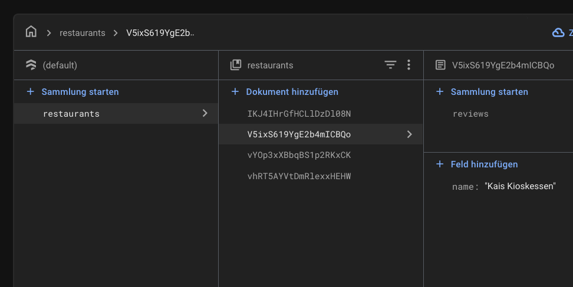

# simple_restaurant_example_firebase

Sehr kleines Beispiel, das Restaurants (und Reviews) beinhaltet.

## Setup

Das Projekt muss mit Firebase verbunden werden und es muss eine Collection `Restaurant` angelegt werden, in der Restaurants mit einem `name` sind.

Firestore sollte ungefähr so aussehen, wobei die Reviews aktuell weggelassen werden können:

Firestore setup                    | 
:--------------------------------:
{width=250}

## Todo

Die Reviews werden aktuell nicht verwenden (und müssen daher noch nicht angelegt werden).